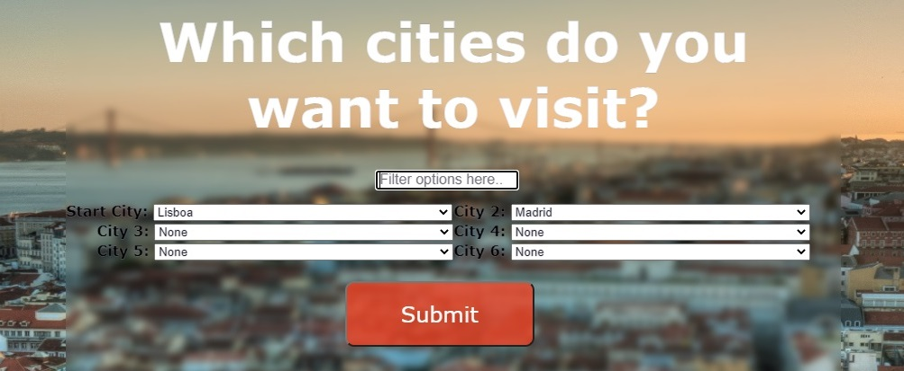
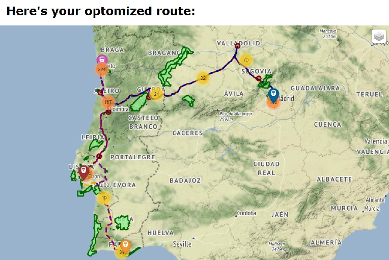

# Interrail planer

## The application
This Python based application is designed to help users plan interrail trips based on their preferences of selected countries and citites in Europe. 
From OpenStreetMap (OSM) through the Overpass API, the application collects data about the railway network in the countries selected by the user, and calculates the optimal route between the chosen multiple cities. The results are visualised in a map in your webbrowser. 

## Input parameters
The input parameters from users are:
- Which countries to visit:

- Which cities to visit:

## Requirements and script running
Following is required to run the program.
- Python 3
- the packages of the required_packages.txt
- Run python server.py in the console to start the program
- After submissions of choices in the browser and during the web loading, there are info messages in the python console printed

## Data
The data extracted from OSM is:
- railways
- stations
- cities
- heritage/cultural sites
- natural parks  

-> All the raw data is as json and geojson in the folder data/original

## Pre-processing
The Overpass API returns crude data in json format that requiers aditional data pre-processing to create a network where routing can be performed.
The pre-processing is as follows:
- Snap stations to rails. This geograpically aligns the stations with the railway tracks. 
- Split segments where stations are snapped to the rail, creating two segments from the original one. This enables stations to be start and end points of the network. 
- Connecting stations by creating artificial rails between stations closer than 500 m to each other. This is to simulate changing trains at two different stations or even platforms that are near to each other.  

-> The pre-processed and merged data is stored as shapefiles in the folder data/processed/z_database/country1_country_2...   
-> If data for a particular combination for countries has been already preprocessed it calls the files for the routing otherwise, preprocessing is performed the first time

## Routing
The routing process consist of the following steps:
- Linking stations to cities. 
- Creating a shortest path distance matrix between all combinations of input cities using Dijkstra's algorithm.
- Based on the distance matrix, the "traveling salesman problem (TSP)" is solved.
- Finally, other cities, cultural sites and natural parks that are in geographical proximity to the route are linked to the route.   

-> The final routing data is as shapefiles in the folder data/route

## Output and Visualisation
Using the Python based micro web-framework Flask, the final route is presented on a map in the user's web browser toghetere with reccomended cities, cultural sites and natural parks.

## Possible issues
- Data download: Downloading OSM data from Overpass API can fail for big countries like Germany or France. Furthermore, after several trials in a short time span you can exceed your download contingent and your host name / IP-adress can be blocked. Either you can use already downloaded data for certain countries (see in data/original) or try the download later.
- Routing problems: Problems with the routing occor when no path can be found for some cities (this is due to unconnected railway networks in OSM data, or caused by the preprocessing or creation of the graph network. It also occurs if you choose non-adjacent countries without a railway connection). In this case the program redirects you to the city selection site and shows you which city is the problem city.  
(note 1: To detect one single problem city at least three cities have to be chosen as destinations)  
(note 2: Even when the first problem city is removed from your input, it can happen that another city also causes path errors. Then, you are redirected to the city selection site again)
- Translation of names: For cities and stations in Greece and North Macedonia you can only choose features where an english name exists. For all other countries and data local names are displayed. Many warnings can be printed in the console due to the conversion into shapefiles (in a postrgreSQL database this problem could be avoided)
